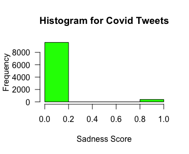
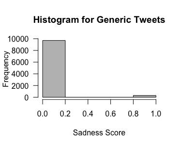
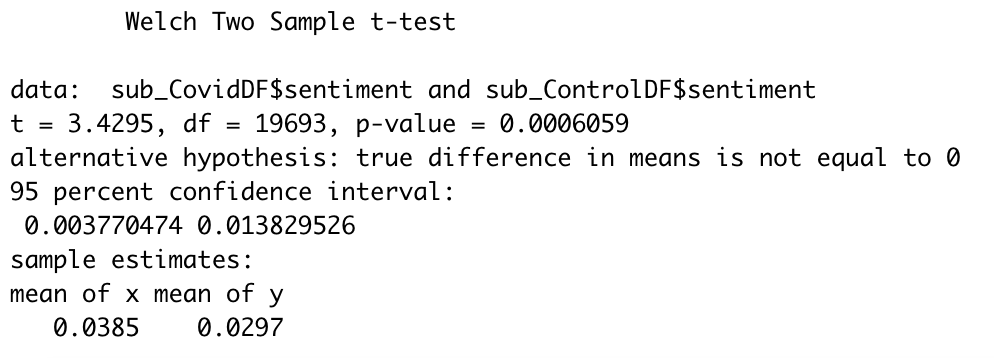

# COMM220_TwitterNLP
This repository is for Jake's final project in COMM 220: Research Methods in Communication Science course at UCLA.

### Introduction
Although my research interests are rooted in UX, I am curious about its applications to a subfield of informatics called disaster (crisis) informatics, which pulls from both information and communication disciplines. I am primarily interested in how information and communications technology (ICT) harness unstructured data that can provide valuable insights about user experiences, especially in the wake of crises. Similar to the approach of crisis informatics researchers like Palen et al in their use of Twitter data for contextualized social media analysis, this project leverages the use of natural language processing to better understand how Americans are using Twitter to express information about disasters. I will focus specifically on how users in the United States communicate about their experiences with COVID-19. The vocabularies of these tweets will be analyzed using the popular lexicon developed by the NRC. The goal of this confirmatory research is to scrape information from recent Tweets about COVID and loop them through several sentiments from the NRC lexicon to confirm which sentiments return statistically significant results in comparison to generic tweets that are unrelated to COVID. I hypothesize that users posting about COVID will signal more evidence of sadness than other tweets in general.

### Methods

To collect the data for this research project I needed to install the R package called “rtweet.” This package uses Twitter’s API to collect data, allowing customizable inquiries (i.e., searching by keyword, location, language, etc.) and import all of this data directly into R for easy analysis. I used the rtweet package to collect 5000 tweets from the United States that are in English and included the word “COVID.” I also collected a similar sample of 5000 tweets that specifically did not include the word “COVID” which served as my control group.

Once this data was collected, I used an R package called “reactable” that can produce a filterable table in HTML for each group of tweets. These tables offered an easy way to preview the collected data to make sure the tweets were in English, from the United States, and filtered correctly to include or exclude the word “COVID” as I expected. I also used an R package called “glue” to append the URL for each tweet so I could sample a few data points and view them in context, verifying that they were legitimately pulled from Twitter. I wrestled with the contents of the tweets to get all of the data into a usable format for the sentiment analysis. I used a library called “tidytext” to convert all of the text to lowercase. I also needed to remove stop words and http elements from the data so they wouldn’t be included in the analysis.  

After polishing the data, I ran the first analysis using the “sadness” sentiment from the NRC lexicon. A for loop runs through each of the words in the COVID tweets (~60,000 to 70,000 words) and identifies which words are also in the “sadness” lexicon. The loop will assign a word the value 1 if it matches or a value of 0 if it does not match. Once every word has been assigned a value, the next for loop will create a subset of 10,000 randomly selected words from the larger set. This process is then repeated for the control tweets (~40,000 to 50,000 words) and a value is assigned to each word. A subset of 10,000 words is then randomly selected from the control group for hypothesis testing with the subset from the COVID tweets. A histogram for each subset of 10,000 words is produced to show the distribution of scores for the COVID tweets and the control tweets before conducting a t-test.

### Preliminary Results
The histograms show that a majority of words from the subset for both groups did not score for “sadness.” However, the COVID tweets (Figure 1) appear to have slightly more words that scored for “sadness” than words pulled from the generic tweets (Figure 2).

**Figure 1**

*Histogram for COVID Tweets*

**Figure 2**

*Histogram for Generic Tweets*

A very subtle relationship between these two groups may be interpreted from these graphs, but some hypothesis testing is necessary to confirm this. A t-test is performed using the t.test function in R to identify whether the difference in means between these two groups is statistically significant or not.

The results of the hypothesis test (Figure 3) show that the average score for the words sampled from the COVID tweets was 0.039 and the average score for the words sampled from the control group were 0.030. Since the p-value of 0.006 is less than 0.05, we reject the null hypothesis at the 95% confidence interval. We accept the alternative hypothesis that tweets about COVID are more likely to signal evidence of sadness.

**Figure 3**

*Welch Two Sample t-test*

### Conclusion
This research project successfully uses natural language processing techniques to understand how Twitter users generally feel about the COVID-19 pandemic. By sampling data from users communicating through the social media platform, we can compare the difference in attitudes between conversations about COVID and generalized tweets. This distinction can be made by analyzing their vocabularies using the NRC lexicon. Although attitudes may vary among users, we can identify that users feel a stronger sentiment of sadness towards COVID than general tweets that are unrelated to COVID. All of the code used for this project is available in an open-source library available on [GitHub](https://github.com/jaketompkins97/COMM220_TwitterNLP/blob/main/final_comm220.R) for reproducibility.
This use of natural language processing does warrant further conversations about how lexicons like NRC are developed and how their trustworthiness can vary in different contexts. Considerations should be made about how the context of a word being used may change it’s connotation, which may also conflict with how it is defined in the lexicon being used for the analysis. It is important for a researcher to be critical of how this context can characterize the language they are processing and what ramifications this could have on the accuracy of their results.
